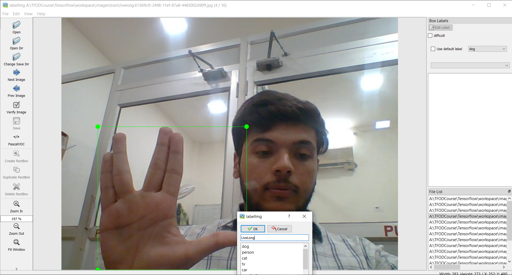
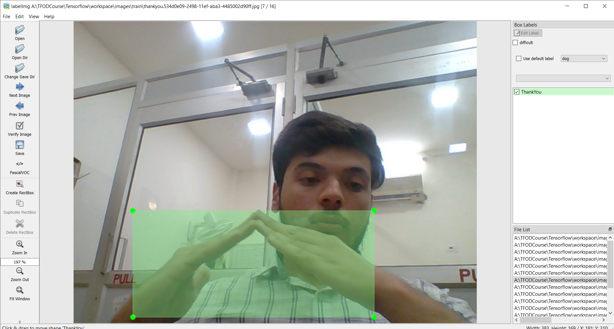
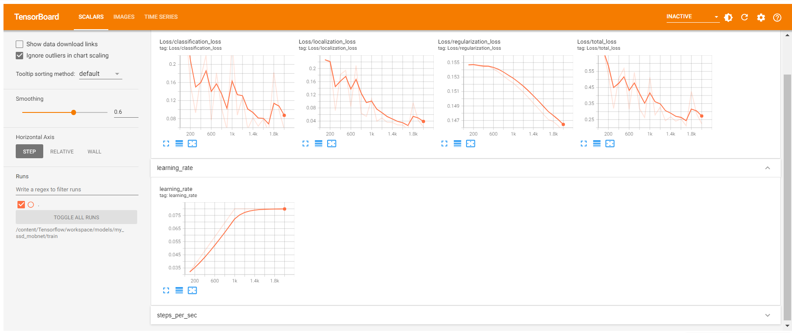
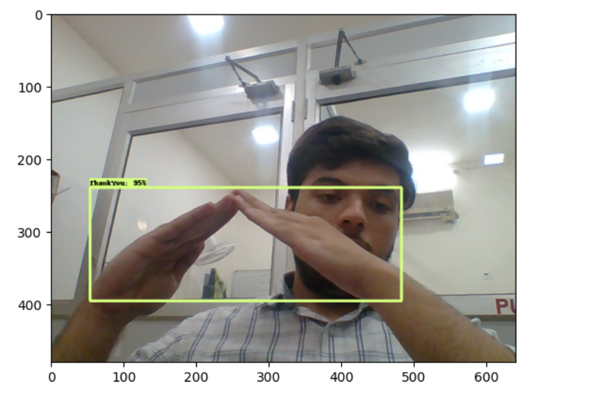

# Project Theme: Optimizing Power Efficiency in Induction Furnaces through Advanced Object Detection Technology

### Name of Mentor: Ahmad Raza

### Department: SMS 2

### Trainee: Armaan, Nitin

---

## Context

In a steel manufacturing process, a ladle is used to transfer molten steel from an Electric Arc Furnace (EAF) to an Argon Oxygen Decarburization (AOD) unit for further chemical processing. The continuous operation and synchronization between these units are critical for maintaining efficiency and product quality. However, there can be instances where the ladle may pause during the transfer process, causing potential delays and disruptions.

## Problem Statement

The goal is to develop a system that can:

1. Detect the ladle as it moves between the EAF and AOD units.
2. Track the ladle's movement to determine if it is moving or paused.
3. Provide a signal or alert to the operator when the ladle is paused, so appropriate actions can be taken to minimize delays.

## 1. Understanding the Project

The project involves the application of computer vision techniques to a specific domain. The primary objective is to leverage computer vision technology to solve a problem or improve a process. To gain a thorough understanding of the project's requirements and objectives, a comprehensive project brief was reviewed. This included the project's scope, goals, deliverables, and the expected impact of the project outcomes. The initial phase focused on identifying the specific problem to be addressed, the data required, and the methodologies to be employed in the project.

## 2. Site Visit

A site visit was conducted to gather firsthand information and insights into the practical aspects of the project. During the site visit, observations were made regarding the environment and any potential challenges that might be encountered.This step was crucial in aligning the project's objectives with real-world scenarios.

## 3. Learned Basics of Computer Vision

To effectively contribute to the project, it was essential to acquire a foundational understanding of computer vision. This involved studying the basic concepts and techniques used in the field. Key topics covered included:

- **Image Processing:** Understanding how images are represented, processed, and manipulated in a digital format.
- **Feature Extraction:** Learning how to identify and extract significant features from images that can be used for analysis.
- **Object Detection and Recognition:** Studying methods for detecting and recognizing objects within images.
- **Machine Learning in Computer Vision:** Exploring how machine learning algorithms are applied to computer vision tasks.

This foundational knowledge equipped me with the skills needed to approach the project's computer vision tasks competently.

## 4. Installation of Anaconda

To create a suitable development environment, Anaconda was installed. Anaconda is a widely-used distribution of Python and R for scientific computing, which simplifies package management and deployment. The steps involved in the installation were:

- Downloading the Anaconda installer from the official website.
- Running the installer and following the on-screen instructions to complete the installation.
- Verifying the installation by opening Anaconda Navigator and ensuring that the necessary tools were available.

Anaconda provided a robust platform for managing the various packages and dependencies required for the project.

## 5. Creation of Virtual Environment

A virtual environment was created to ensure that the project's dependencies were isolated and managed efficiently. This involved the following steps:

- Opening Anaconda Prompt or Terminal.
- Creating a new virtual environment using the command: `conda create --name project_env python=3.8`
- Activating the virtual environment with the command: `conda activate project_env`

The virtual environment allowed for the installation of specific versions of libraries and tools without affecting other projects or the system's global Python environment.

## 6. Installation of Jupyter Notebook

Jupyter Notebook was installed within the virtual environment to facilitate interactive computing and documentation. The steps included:

- Activating the virtual environment.
- Installing Jupyter Notebook using the command: `conda install jupyter`
- Launching Jupyter Notebook with the command: `jupyter notebook`

Jupyter Notebook provided an interactive platform for developing and testing code, visualizing data, and documenting the analysis process.

## 7. Learned About Image Labeling and Annotation

An essential part of the project involved learning how to label and annotate images. Image labeling and annotation are critical steps in preparing data for computer vision tasks, such as training machine learning models. The process included:

- Understanding different types of annotations, such as bounding boxes, polygons, and key points.
- Using annotation tools like LabelImg and VGG Image Annotator (VIA) to label images.
- Creating and managing annotation files in formats such as XML, JSON, or CSV, which are compatible with machine learning frameworks.

This knowledge enabled the accurate and consistent labeling of images, which is crucial for the success of the computer vision models.

---

By following these steps, a strong foundation was established for the successful execution of the project. Each phase contributed to a deeper understanding and more effective application of computer vision techniques, ensuring that the project objectives could be met efficiently.

## Docker

Docker is an open-source platform designed to automate the deployment, scaling, and management of applications within containers. Containers are lightweight, stand-alone, executable packages that include everything needed to run a piece of software, including the code, runtime, libraries, and system tools. Docker ensures that applications run consistently across different computing environments.

#### Key Features of Docker

- **Portability**: Docker containers can run on any system that supports Docker, ensuring consistent environments across development, testing, and production.
- **Isolation**: Each container runs in its own isolated environment, preventing conflicts between applications and improving security.
- **Efficiency**: Containers share the host system’s kernel and resources, making them more lightweight than traditional virtual machines.
- **Scalability**: Docker makes it easy to scale applications horizontally by adding more container instances.

#### Docker Components

- **Docker Engine**: The core of Docker, responsible for building and running Docker containers.
- **Docker Hub**: A cloud-based registry service for sharing container images.
- **Docker Compose**: A tool for defining and running multi-container Docker applications using a simple YAML file.

## About TensorFlow

TensorFlow is an open-source machine learning framework developed by the Google Brain team. It is designed to simplify the development and deployment of machine learning models and provides a comprehensive ecosystem of tools, libraries, and community resources.

#### Key Features of TensorFlow

- **Flexibility**: TensorFlow supports various machine learning tasks, including neural networks, natural language processing, and computer vision.
- **Ecosystem**: TensorFlow offers a rich set of tools like TensorBoard for visualization, TensorFlow Lite for mobile and embedded devices, and TensorFlow Extended (TFX) for end-to-end ML pipelines.
- **Community Support**: TensorFlow has a large and active community, contributing to a wide range of resources, tutorials, and third-party libraries.
- **Performance**: TensorFlow is optimized for high performance on both CPUs and GPUs, making it suitable for large-scale machine learning tasks.

#### TensorFlow Components

- **TensorFlow Core**: The primary library for building and training machine learning models.
- **Keras**: An API built on top of TensorFlow for simplifying the creation of neural networks.
- **TensorFlow Hub**: A repository of reusable machine learning modules.
- **TensorFlow Serving**: A flexible, high-performance serving system for machine learning models.

By leveraging Docker to run TensorFlow, developers can ensure a consistent and isolated environment that simplifies the setup and deployment of machine learning applications.

# Installing TensorFlow Using Docker

### Introduction

This report outlines the steps and considerations for installing TensorFlow in a Docker environment. Docker provides a consistent and isolated environment for running applications, making it an excellent choice for setting up TensorFlow for machine learning and deep learning projects.

### Prerequisites

Before starting, ensure you have the following installed on your system:

- Docker
- Docker Compose (optional, for multi-container setups)

### Steps for Installation

1. **Pull TensorFlow Docker Image**

   TensorFlow provides pre-built Docker images for CPU and GPU versions. To pull the latest TensorFlow image for CPU, use the following command:

```python
docker pull tensorflow/tensorflow:latest-gpu-jupyter

```

2. **Accessing Jupyter Notebook**

The TensorFlow Docker image includes Jupyter Notebook. To start a container with Jupyter Notebook, run:

```python

docker run -it --rm -p 8888:8888 tensorflow/tensorflow:latest-jupyter
```

## LabelImg

LabelImg is a graphical image annotation tool used for labeling objects in images for the purpose of training machine learning models, particularly in object detection tasks. It is an open-source tool written in Python and uses the Qt framework for its graphical interface.

#### Key Features of LabelImg

- **User-Friendly Interface**: Provides an intuitive GUI for easy and efficient image annotation.
- **Support for Multiple Formats**: Allows saving annotations in both PASCAL VOC and YOLO format, which are widely used in various object detection frameworks.
- **Cross-Platform**: Available for Windows, macOS, and Linux, making it accessible to a broad range of users.
- **Customizable Classes**: Users can define custom object classes for labeling, providing flexibility to cater to different project requirements.

#### Steps to Use LabelImg

**Installation**

You can install LabelImg via pip or directly from the GitHub repository. To install via pip, use the following command:

```python
if not os.path.exists(LABELIMG_PATH):
    !mkdir {LABELIMG_PATH}
    !git clone https://github.com/tzutalin/labelImg {LABELIMG_PATH}
if os.name == 'posix':
    !make qt5py3
if os.name =='nt':
    !cd {LABELIMG_PATH} && pyrcc5 -o libs/resources.py resources.qrc


```

```bash
!cd {LABELIMG_PATH} && python labelImg.py
```




---

### XML Files: An Overview

**XML (Extensible Markup Language)** is a markup language that defines a set of rules for encoding documents in a format that is both human-readable and machine-readable. XML is designed to store and transport data, and it provides a flexible way to create information formats and share both the format and the data on the World Wide Web, intranets, and elsewhere.

### Use of XML in Annotating and Labeling Images

In the context of machine learning, particularly in computer vision, XML files are commonly used for annotating and labeling images. These annotations are crucial for training models to recognize and classify objects within images.

#### Common Formats and Applications:

1. **Pascal VOC (Visual Object Classes):**

   - A widely used format for object detection tasks.
   - Each image has an associated XML file containing annotations.
   - The structure includes:
     - **folder:** The folder containing the image.
     - **filename:** The name of the image file.
     - **size:** Image dimensions (width, height, depth).
     - **object:** For each object, it includes:
       - **name:** Class label of the object.
       - **pose:** (Optional) The pose of the object.
       - **truncated:** Whether the object is truncated.
       - **difficult:** Whether the object is difficult to detect.
       - **bndbox:** The bounding box coordinates (xmin, ymin, xmax, ymax).

2. **ImageNet:**

This format is similar to Pascal VOC but tailored to the ImageNet dataset specifics.

#### Example of an XML Annotation File (Pascal VOC):

```xml
<annotation>
    <folder>images</folder>
    <filename>image1.jpg</filename>
    <size>
        <width>800</width>
        <height>600</height>
        <depth>3</depth>
    </size>
    <object>
        <name>cat</name>
        <pose>Left</pose>
        <truncated>0</truncated>
        <difficult>0</difficult>
        <bndbox>
            <xmin>120</xmin>
            <ymin>160</ymin>
            <xmax>360</xmax>
            <ymax>480</ymax>
        </bndbox>
    </object>
</annotation>
```

XML files play a crucial role in the annotation and labeling of images for training machine learning models, particularly in the field of computer vision. Their structured and extensible nature makes them ideal for storing detailed information about image annotations, enabling effective and efficient training of models.

# Object Detection Model Training Report

## Introduction

This report documents the process of training a custom object detection model using TensorFlow Object Detection API. The objective is to create a model capable of detecting specific objects in images and real-time video streams.

## Methodology

### 1. Setting up Paths and Configurations

- Define paths and configurations for the project
- This includes paths for workspace, scripts, pretrained models, etc.
- Explanation: This section sets up necessary paths and configurations required for the project.
- These paths are used throughout the training process for storing data scripts and models

```python
CUSTOM_MODEL_NAME = 'my_ssd_mobnet'
PRETRAINED_MODEL_NAME = 'ssd_mobilenet_v2_fpnlite_320x320_coco17_tpu-8'
PRETRAINED_MODEL_URL = 'http://download.tensorflow.org/models/object_detection/tf2/20200711/ssd_mobilenet_v2_fpnlite_320x320_coco17_tpu-8.tar.gz'
TF_RECORD_SCRIPT_NAME = 'generate_tfrecord.py'
LABEL_MAP_NAME = 'label_map.pbtxt'

paths = {
    'WORKSPACE_PATH': os.path.join('Tensorflow', 'workspace'),
    'SCRIPTS_PATH': os.path.join('Tensorflow','scripts'),
    'APIMODEL_PATH': os.path.join('Tensorflow','models'),
    'ANNOTATION_PATH': os.path.join('Tensorflow', 'workspace','annotations'),
    'IMAGE_PATH': os.path.join('Tensorflow', 'workspace','images'),
    'MODEL_PATH': os.path.join('Tensorflow', 'workspace','models'),
    'PRETRAINED_MODEL_PATH': os.path.join('Tensorflow', 'workspace','pre-trained-models'),
    'CHECKPOINT_PATH': os.path.join('Tensorflow', 'workspace','models',CUSTOM_MODEL_NAME),
    'OUTPUT_PATH': os.path.join('Tensorflow', 'workspace','models',CUSTOM_MODEL_NAME, 'export'),
    'TFJS_PATH':os.path.join('Tensorflow', 'workspace','models',CUSTOM_MODEL_NAME, 'tfjsexport'),
    'TFLITE_PATH':os.path.join('Tensorflow', 'workspace','models',CUSTOM_MODEL_NAME, 'tfliteexport'),
    'PROTOC_PATH':os.path.join('Tensorflow','protoc')
 }

files = {
    'PIPELINE_CONFIG':os.path.join('Tensorflow', 'workspace','models', CUSTOM_MODEL_NAME, 'pipeline.config'),
    'TF_RECORD_SCRIPT': os.path.join(paths['SCRIPTS_PATH'], TF_RECORD_SCRIPT_NAME),
    'LABELMAP': os.path.join(paths['ANNOTATION_PATH'], LABEL_MAP_NAME)
}
```

### 2. Downloading TF Models Pretrained Models and Installing TFOD

- Download TensorFlow Models repository and install required packages
- Explanation: This section downloads the TensorFlow Models repository if it's not already present.
- It also installs necessary packages and sets up the Object Detection API for training.

```python
# https://www.tensorflow.org/install/source_windows
import re
!apt-get install wget --yes
if not os.path.exists(os.path.join(paths['APIMODEL_PATH'], 'research', 'object_detection')):
    !git clone https://github.com/tensorflow/models {paths['APIMODEL_PATH']}

# Clone the TensorFlow models repository from GitHub
if not os.path.exists(os.path.join(paths['APIMODEL_PATH'], 'research', 'object_detection')):
    !git clone --depth 1 https://github.com/tensorflow/models {paths['APIMODEL_PATH']}
# Copy setup files into models/research folder
%%bash
cd Tensorflow/models/research/
protoc object_detection/protos/*.proto --python_out=.
#cp object_detection/packages/tf2/setup.py .

# Uninstall Cython as a temporary fix for the "No module named 'object_detection'" error
!pip uninstall Cython -y

# Modify setup.py file to install the tf-models-official repository targeted at TF v2.8.0
setup_file_path = os.path.join(paths['APIMODEL_PATH'], 'research', 'object_detection', 'packages', 'tf2', 'setup.py')
with open(setup_file_path) as f:
    s = f.read()

with open(os.path.join(paths['APIMODEL_PATH'], 'research', 'setup.py'), 'w') as f:
    s = re.sub('tf-models-official>=2.5.1', 'tf-models-official==2.8.0', s)
    f.write(s)

# Install the Object Detection API (NOTE: This block takes about 10 minutes to finish executing)
!pip install pyyaml==5.3
!pip install {os.path.join(paths['APIMODEL_PATH'], 'research')}

# Need to downgrade to TF v2.8.0 due to Colab compatibility bug with TF v2.10 (as of 10/03/22)
!pip install tensorflow==2.8.0

!pip install tensorflow_io==0.23.1

VERIFICATION_SCRIPT = os.path.join(paths['APIMODEL_PATH'], 'research', 'object_detection', 'builders', 'model_builder_tf2_test.py')
# Verify Installation
!python {VERIFICATION_SCRIPT}

!pip install tensorflow --upgrade

!pip uninstall protobuf matplotlib -y
!pip install protobuf matplotlib==3.2

import object_detection

if os.name =='posix':
    !wget {PRETRAINED_MODEL_URL}
    !mv {PRETRAINED_MODEL_NAME+'.tar.gz'} {paths['PRETRAINED_MODEL_PATH']}
    !cd {paths['PRETRAINED_MODEL_PATH']} && tar -zxvf {PRETRAINED_MODEL_NAME+'.tar.gz'}
if os.name == 'nt':
    wget.download(PRETRAINED_MODEL_URL)
    !move {PRETRAINED_MODEL_NAME+'.tar.gz'} {paths['PRETRAINED_MODEL_PATH']}
    !cd {paths['PRETRAINED_MODEL_PATH']} && tar -zxvf {PRETRAINED_MODEL_NAME+'.tar.gz'}


```

### 3. Creating Label Map

- Create label map for custom objects
- Explanation: Label maps associate class names with unique IDs.
- In this section, a label map is created for the custom objects to be detected by the model.

```python


labels = [{'name':'ThumbsUp', 'id':1}, {'name':'ThumbsDown', 'id':2}, {'name':'ThankYou', 'id':3}, {'name':'LiveLong', 'id':4}]

with open(files['LABELMAP'], 'w') as f:
    for label in labels:
        f.write('item { \n')
        f.write('\tname:\'{}\'\n'.format(label['name']))
        f.write('\tid:{}\n'.format(label['id']))
        f.write('}\n')
```

### 4. Creating TF Records

- Convert dataset into TFRecord format
- Explanation: TFRecord files store the dataset in a format suitable for TensorFlow.
- This step is crucial for training the model as TensorFlow expects data in TFRecord format.

```python
# OPTIONAL IF RUNNING ON COLAB
ARCHIVE_FILES = os.path.join(paths['IMAGE_PATH'], 'archive.tar.gz')
if os.path.exists(ARCHIVE_FILES):
  !tar -zxvf {ARCHIVE_FILES}

if not os.path.exists(files['TF_RECORD_SCRIPT']):
    !git clone https://github.com/nicknochnack/GenerateTFRecord {paths['SCRIPTS_PATH']}

!python {files['TF_RECORD_SCRIPT']} -x {os.path.join(paths['IMAGE_PATH'], 'train')} -l {files['LABELMAP']} -o {os.path.join(paths['ANNOTATION_PATH'], 'train.record')}
!python {files['TF_RECORD_SCRIPT']} -x {os.path.join(paths['IMAGE_PATH'], 'test')} -l {files['LABELMAP']} -o {os.path.join(paths['ANNOTATION_PATH'], 'test.record')}


```

### 5. Copying Model Config to Training Folder

- Copy pretrained model configuration to the custom model directory
- Explanation: The pipeline configuration file from the pretrained model is copied to the custom model directory.
- This configuration file specifies the architecture and parameters of the model.

```python
if os.name =='posix':
    !cp {os.path.join(paths['PRETRAINED_MODEL_PATH'], PRETRAINED_MODEL_NAME, 'pipeline.config')} {os.path.join(paths['CHECKPOINT_PATH'])}
if os.name == 'nt':
    !copy {os.path.join(paths['PRETRAINED_MODEL_PATH'], PRETRAINED_MODEL_NAME, 'pipeline.config')} {os.path.join(paths['CHECKPOINT_PATH'])}
```

### 6. Updating Config For Transfer Learning

- Update pipeline configuration for transfer learning
- Explanation: The pipeline configuration is updated with details relevant to the custom model.
- This includes the number of classes, batch size, fine-tuning checkpoint, etc.

```python
import tensorflow as tf
from object_detection.utils import config_util
from object_detection.protos import pipeline_pb2
from google.protobuf import text_format

config = config_util.get_configs_from_pipeline_file(files['PIPELINE_CONFIG'])

config

pipeline_config = pipeline_pb2.TrainEvalPipelineConfig()
with tf.io.gfile.GFile(files['PIPELINE_CONFIG'], "r") as f:
    proto_str = f.read()
    text_format.Merge(proto_str, pipeline_config)

pipeline_config.model.ssd.num_classes = len(labels)
pipeline_config.train_config.batch_size = 4
pipeline_config.train_config.fine_tune_checkpoint = os.path.join(paths['PRETRAINED_MODEL_PATH'], PRETRAINED_MODEL_NAME, 'checkpoint', 'ckpt-0')
pipeline_config.train_config.fine_tune_checkpoint_type = "detection"
pipeline_config.train_input_reader.label_map_path= files['LABELMAP']
pipeline_config.train_input_reader.tf_record_input_reader.input_path[:] = [os.path.join(paths['ANNOTATION_PATH'], 'train.record')]
pipeline_config.eval_input_reader[0].label_map_path = files['LABELMAP']
pipeline_config.eval_input_reader[0].tf_record_input_reader.input_path[:] = [os.path.join(paths['ANNOTATION_PATH'], 'test.record')]

config_text = text_format.MessageToString(pipeline_config)
with tf.io.gfile.GFile(files['PIPELINE_CONFIG'], "wb") as f:
    f.write(config_text)


```

### 7. Training the Model

- Train the custom object detection model
- Explanation: The model is trained using the specified configuration and dataset.
- This step involves running the training script with appropriate parameters.

```python

TRAINING_SCRIPT = os.path.join(paths['APIMODEL_PATH'], 'research', 'object_detection', 'model_main_tf2.py')

command = "python {} --model_dir={} --pipeline_config_path={} --num_train_steps=3000".format(TRAINING_SCRIPT, paths['CHECKPOINT_PATH'],files['PIPELINE_CONFIG'])
!{command}
```

### Loss Regulation



### 9. Loading Trained Model From Checkpoint

- Load trained model from checkpoint
- Explanation: The trained model is loaded from the checkpoint for further use.
- This allows us to perform inference or continue training from the saved checkpoint.

```python
import cv2
import numpy as np
from matplotlib import pyplot as plt
%matplotlib inline

category_index = label_map_util.create_category_index_from_labelmap(files['LABELMAP'])

IMAGE_PATH = os.path.join(paths['IMAGE_PATH'], 'test', 'thankyou.54820f05-2498-11ef-9aa8-4485002d90ff.jpg')

img = cv2.imread(IMAGE_PATH)
image_np = np.array(img)

input_tensor = tf.convert_to_tensor(np.expand_dims(image_np, 0), dtype=tf.float32)
detections = detect_fn(input_tensor)

num_detections = int(detections.pop('num_detections'))
detections = {key: value[0, :num_detections].numpy()
              for key, value in detections.items()}
detections['num_detections'] = num_detections

# detection_classes should be ints.
detections['detection_classes'] = detections['detection_classes'].astype(np.int64)

label_id_offset = 1
image_np_with_detections = image_np.copy()

viz_utils.visualize_boxes_and_labels_on_image_array(
            image_np_with_detections,
            detections['detection_boxes'],
            detections['detection_classes']+label_id_offset,
            detections['detection_scores'],
            category_index,
            use_normalized_coordinates=True,
            max_boxes_to_draw=5,
            min_score_thresh=.8,
            agnostic_mode=False)

plt.imshow(cv2.cvtColor(image_np_with_detections, cv2.COLOR_BGR2RGB))
plt.show()

```


