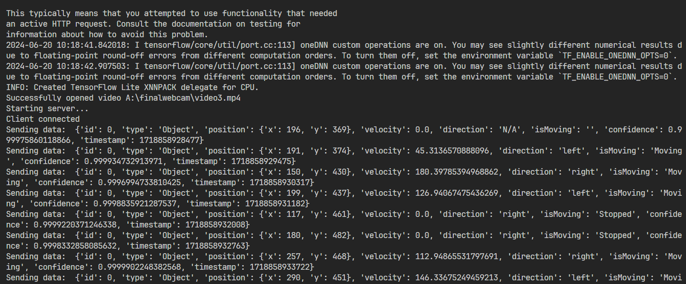

# Project Theme: Optimizing Power Efficiency in Induction Furnaces through Advanced Object Detection Technology

### Name of Mentor: Ahmad Raza

### Department: SMS 2

### Trainee: Armaan, Nitin

---

## Context

In a steel manufacturing process, a ladle is used to transfer molten steel from an Electric Arc Furnace (EAF) to an Argon Oxygen Decarburization (AOD) unit for further chemical processing. The continuous operation and synchronization between these units are critical for maintaining efficiency and product quality. However, there can be instances where the ladle may pause during the transfer process, causing potential delays and disruptions.

## Problem Statement

The goal is to develop a system that can:

1. Detect the ladle as it moves between the EAF and AOD units.
2. Track the ladle's movement to determine if it is moving or paused.
3. Provide a signal or alert to the operator when the ladle is paused, so appropriate actions can be taken to minimize delays.

## 1. Understanding the Project

The project involves the application of computer vision techniques to a specific domain. The primary objective is to leverage computer vision technology to solve a problem or improve a process. To gain a thorough understanding of the project's requirements and objectives, a comprehensive project brief was reviewed. This included the project's scope, goals, deliverables, and the expected impact of the project outcomes. The initial phase focused on identifying the specific problem to be addressed, the data required, and the methodologies to be employed in the project.

## 2. Site Visit

A site visit was conducted to gather firsthand information and insights into the practical aspects of the project. During the site visit, observations were made regarding the environment and any potential challenges that might be encountered.This step was crucial in aligning the project's objectives with real-world scenarios.

## 3. Learned Basics of Computer Vision

To effectively contribute to the project, it was essential to acquire a foundational understanding of computer vision. This involved studying the basic concepts and techniques used in the field. Key topics covered included:

- **Image Processing:** Understanding how images are represented, processed, and manipulated in a digital format.
- **Feature Extraction:** Learning how to identify and extract significant features from images that can be used for analysis.
- **Object Detection and Recognition:** Studying methods for detecting and recognizing objects within images.
- **Machine Learning in Computer Vision:** Exploring how machine learning algorithms are applied to computer vision tasks.

This foundational knowledge equipped me with the skills needed to approach the project's computer vision tasks competently.

## 4. Installation of Anaconda

To create a suitable development environment, Anaconda was installed. Anaconda is a widely-used distribution of Python and R for scientific computing, which simplifies package management and deployment. The steps involved in the installation were:

- Downloading the Anaconda installer from the official website.
- Running the installer and following the on-screen instructions to complete the installation.
- Verifying the installation by opening Anaconda Navigator and ensuring that the necessary tools were available.

Anaconda provided a robust platform for managing the various packages and dependencies required for the project.

## 5. Creation of Virtual Environment

A virtual environment was created to ensure that the project's dependencies were isolated and managed efficiently. This involved the following steps:

- Opening Anaconda Prompt or Terminal.
- Creating a new virtual environment using the command: `conda create --name project_env python=3.8`
- Activating the virtual environment with the command: `conda activate project_env`

The virtual environment allowed for the installation of specific versions of libraries and tools without affecting other projects or the system's global Python environment.

## 6. Installation of Jupyter Notebook

Jupyter Notebook was installed within the virtual environment to facilitate interactive computing and documentation. The steps included:

- Activating the virtual environment.
- Installing Jupyter Notebook using the command: `conda install jupyter`
- Launching Jupyter Notebook with the command: `jupyter notebook`

Jupyter Notebook provided an interactive platform for developing and testing code, visualizing data, and documenting the analysis process.

## 7. Learned About Image Labeling and Annotation

An essential part of the project involved learning how to label and annotate images. Image labeling and annotation are critical steps in preparing data for computer vision tasks, such as training machine learning models. The process included:

- Understanding different types of annotations, such as bounding boxes, polygons, and key points.
- Using annotation tools like LabelImg and VGG Image Annotator (VIA) to label images.
- Creating and managing annotation files in formats such as XML, JSON, or CSV, which are compatible with machine learning frameworks.

This knowledge enabled the accurate and consistent labeling of images, which is crucial for the success of the computer vision models.

---

By following these steps, a strong foundation was established for the successful execution of the project. Each phase contributed to a deeper understanding and more effective application of computer vision techniques, ensuring that the project objectives could be met efficiently.

## Docker

Docker is an open-source platform designed to automate the deployment, scaling, and management of applications within containers. Containers are lightweight, stand-alone, executable packages that include everything needed to run a piece of software, including the code, runtime, libraries, and system tools. Docker ensures that applications run consistently across different computing environments.

#### Key Features of Docker

- **Portability**: Docker containers can run on any system that supports Docker, ensuring consistent environments across development, testing, and production.
- **Isolation**: Each container runs in its own isolated environment, preventing conflicts between applications and improving security.
- **Efficiency**: Containers share the host system’s kernel and resources, making them more lightweight than traditional virtual machines.
- **Scalability**: Docker makes it easy to scale applications horizontally by adding more container instances.

#### Docker Components

- **Docker Engine**: The core of Docker, responsible for building and running Docker containers.
- **Docker Hub**: A cloud-based registry service for sharing container images.
- **Docker Compose**: A tool for defining and running multi-container Docker applications using a simple YAML file.

## About TensorFlow

TensorFlow is an open-source machine learning framework developed by the Google Brain team. It is designed to simplify the development and deployment of machine learning models and provides a comprehensive ecosystem of tools, libraries, and community resources.

#### Key Features of TensorFlow

- **Flexibility**: TensorFlow supports various machine learning tasks, including neural networks, natural language processing, and computer vision.
- **Ecosystem**: TensorFlow offers a rich set of tools like TensorBoard for visualization, TensorFlow Lite for mobile and embedded devices, and TensorFlow Extended (TFX) for end-to-end ML pipelines.
- **Community Support**: TensorFlow has a large and active community, contributing to a wide range of resources, tutorials, and third-party libraries.
- **Performance**: TensorFlow is optimized for high performance on both CPUs and GPUs, making it suitable for large-scale machine learning tasks.

#### TensorFlow Components

- **TensorFlow Core**: The primary library for building and training machine learning models.
- **Keras**: An API built on top of TensorFlow for simplifying the creation of neural networks.
- **TensorFlow Hub**: A repository of reusable machine learning modules.
- **TensorFlow Serving**: A flexible, high-performance serving system for machine learning models.

By leveraging Docker to run TensorFlow, developers can ensure a consistent and isolated environment that simplifies the setup and deployment of machine learning applications.

# Installing TensorFlow Using Docker

### Introduction

This report outlines the steps and considerations for installing TensorFlow in a Docker environment. Docker provides a consistent and isolated environment for running applications, making it an excellent choice for setting up TensorFlow for machine learning and deep learning projects.

### Prerequisites

Before starting, ensure you have the following installed on your system:

- Docker
- Docker Compose (optional, for multi-container setups)

### Steps for Installation

1. **Pull TensorFlow Docker Image**

   TensorFlow provides pre-built Docker images for CPU and GPU versions. To pull the latest TensorFlow image for CPU, use the following command:

```python
docker pull tensorflow/tensorflow:latest-gpu-jupyter

```

2. **Accessing Jupyter Notebook**

The TensorFlow Docker image includes Jupyter Notebook. To start a container with Jupyter Notebook, run:

```python

docker run -it --rm -p 8888:8888 tensorflow/tensorflow:latest-jupyter
```

## LabelImg

LabelImg is a graphical image annotation tool used for labeling objects in images for the purpose of training machine learning models, particularly in object detection tasks. It is an open-source tool written in Python and uses the Qt framework for its graphical interface.

#### Key Features of LabelImg

- **User-Friendly Interface**: Provides an intuitive GUI for easy and efficient image annotation.
- **Support for Multiple Formats**: Allows saving annotations in both PASCAL VOC and YOLO format, which are widely used in various object detection frameworks.
- **Cross-Platform**: Available for Windows, macOS, and Linux, making it accessible to a broad range of users.
- **Customizable Classes**: Users can define custom object classes for labeling, providing flexibility to cater to different project requirements.

#### Steps to Use LabelImg

**Installation**

You can install LabelImg via pip or directly from the GitHub repository. To install via pip, use the following command:

```python
if not os.path.exists(LABELIMG_PATH):
    !mkdir {LABELIMG_PATH}
    !git clone https://github.com/tzutalin/labelImg {LABELIMG_PATH}
if os.name == 'posix':
    !make qt5py3
if os.name =='nt':
    !cd {LABELIMG_PATH} && pyrcc5 -o libs/resources.py resources.qrc


```

```bash
!cd {LABELIMG_PATH} && python labelImg.py
```


---

### XML Files: An Overview

**XML (Extensible Markup Language)** is a markup language that defines a set of rules for encoding documents in a format that is both human-readable and machine-readable. XML is designed to store and transport data, and it provides a flexible way to create information formats and share both the format and the data on the World Wide Web, intranets, and elsewhere.

### Use of XML in Annotating and Labeling Images

In the context of machine learning, particularly in computer vision, XML files are commonly used for annotating and labeling images. These annotations are crucial for training models to recognize and classify objects within images.

#### Common Formats and Applications:

1. **Pascal VOC (Visual Object Classes):**

   - A widely used format for object detection tasks.
   - Each image has an associated XML file containing annotations.
   - The structure includes:
     - **folder:** The folder containing the image.
     - **filename:** The name of the image file.
     - **size:** Image dimensions (width, height, depth).
     - **object:** For each object, it includes:
       - **name:** Class label of the object.
       - **pose:** (Optional) The pose of the object.
       - **truncated:** Whether the object is truncated.
       - **difficult:** Whether the object is difficult to detect.
       - **bndbox:** The bounding box coordinates (xmin, ymin, xmax, ymax).

2. **ImageNet:**

This format is similar to Pascal VOC but tailored to the ImageNet dataset specifics.

#### Example of an XML Annotation File (Pascal VOC):

```xml
<annotation>
    <folder>images</folder>
    <filename>image1.jpg</filename>
    <size>
        <width>800</width>
        <height>600</height>
        <depth>3</depth>
    </size>
    <object>
        <name>cat</name>
        <pose>Left</pose>
        <truncated>0</truncated>
        <difficult>0</difficult>
        <bndbox>
            <xmin>120</xmin>
            <ymin>160</ymin>
            <xmax>360</xmax>
            <ymax>480</ymax>
        </bndbox>
    </object>
</annotation>
```

XML files play a crucial role in the annotation and labeling of images for training machine learning models, particularly in the field of computer vision. Their structured and extensible nature makes them ideal for storing detailed information about image annotations, enabling effective and efficient training of models.

# Object Detection Model Training Report

## Introduction

This report documents the process of training a custom object detection model using TensorFlow Object Detection API. The objective is to create a model capable of detecting specific objects in images and real-time video streams.

## Methodology

### 1. Setting up Paths and Configurations

- Define paths and configurations for the project
- This includes paths for workspace, scripts, pretrained models, etc.
- Explanation: This section sets up necessary paths and configurations required for the project.
- These paths are used throughout the training process for storing data scripts and models

```python
# CODE

CUSTOM_MODEL_NAME = 'my_ssd_mobnet'
PRETRAINED_MODEL_NAME = 'ssd_mobilenet_v2_fpnlite_320x320_coco17_tpu-8'
PRETRAINED_MODEL_URL = 'http://download.tensorflow.org/models/object_detection/tf2/20200711/ssd_mobilenet_v2_fpnlite_320x320_coco17_tpu-8.tar.gz'
TF_RECORD_SCRIPT_NAME = 'generate_tfrecord.py'
LABEL_MAP_NAME = 'label_map.pbtxt'

paths = {
    'WORKSPACE_PATH': os.path.join('Tensorflow', 'workspace'),
    'SCRIPTS_PATH': os.path.join('Tensorflow','scripts'),
    'APIMODEL_PATH': os.path.join('Tensorflow','models'),
    'ANNOTATION_PATH': os.path.join('Tensorflow', 'workspace','annotations'),
    'IMAGE_PATH': os.path.join('Tensorflow', 'workspace','images'),
    'MODEL_PATH': os.path.join('Tensorflow', 'workspace','models'),
    'PRETRAINED_MODEL_PATH': os.path.join('Tensorflow', 'workspace','pre-trained-models'),
    'CHECKPOINT_PATH': os.path.join('Tensorflow', 'workspace','models',CUSTOM_MODEL_NAME),
    'OUTPUT_PATH': os.path.join('Tensorflow', 'workspace','models',CUSTOM_MODEL_NAME, 'export'),
    'TFJS_PATH':os.path.join('Tensorflow', 'workspace','models',CUSTOM_MODEL_NAME, 'tfjsexport'),
    'TFLITE_PATH':os.path.join('Tensorflow', 'workspace','models',CUSTOM_MODEL_NAME, 'tfliteexport'),
    'PROTOC_PATH':os.path.join('Tensorflow','protoc')
 }

files = {
    'PIPELINE_CONFIG':os.path.join('Tensorflow', 'workspace','models', CUSTOM_MODEL_NAME, 'pipeline.config'),
    'TF_RECORD_SCRIPT': os.path.join(paths['SCRIPTS_PATH'], TF_RECORD_SCRIPT_NAME),
    'LABELMAP': os.path.join(paths['ANNOTATION_PATH'], LABEL_MAP_NAME)
}
```

### 2. Downloading TF Models Pretrained Models and Installing TFOD

- Download TensorFlow Models repository and install required packages
- Explanation: This section downloads the TensorFlow Models repository if it's not already present.
- It also installs necessary packages and sets up the Object Detection API for training.

```python
# CODE

import re
!apt-get install wget --yes
if not os.path.exists(os.path.join(paths['APIMODEL_PATH'], 'research', 'object_detection')):
    !git clone https://github.com/tensorflow/models {paths['APIMODEL_PATH']}

# Clone the TensorFlow models repository from GitHub
if not os.path.exists(os.path.join(paths['APIMODEL_PATH'], 'research', 'object_detection')):
    !git clone --depth 1 https://github.com/tensorflow/models {paths['APIMODEL_PATH']}
# Copy setup files into models/research folder
%%bash
cd Tensorflow/models/research/
protoc object_detection/protos/*.proto --python_out=.
#cp object_detection/packages/tf2/setup.py .

# Uninstall Cython as a temporary fix for the "No module named 'object_detection'" error
!pip uninstall Cython -y

# Modify setup.py file to install the tf-models-official repository targeted at TF v2.8.0
setup_file_path = os.path.join(paths['APIMODEL_PATH'], 'research', 'object_detection', 'packages', 'tf2', 'setup.py')
with open(setup_file_path) as f:
    s = f.read()

with open(os.path.join(paths['APIMODEL_PATH'], 'research', 'setup.py'), 'w') as f:
    s = re.sub('tf-models-official>=2.5.1', 'tf-models-official==2.8.0', s)
    f.write(s)

# Install the Object Detection API (NOTE: This block takes about 10 minutes to finish executing)
!pip install pyyaml==5.3
!pip install {os.path.join(paths['APIMODEL_PATH'], 'research')}

# Need to downgrade to TF v2.8.0 due to Colab compatibility bug with TF v2.10 (as of 10/03/22)
!pip install tensorflow==2.8.0

!pip install tensorflow_io==0.23.1

VERIFICATION_SCRIPT = os.path.join(paths['APIMODEL_PATH'], 'research', 'object_detection', 'builders', 'model_builder_tf2_test.py')
# Verify Installation
!python {VERIFICATION_SCRIPT}

!pip install tensorflow --upgrade

!pip uninstall protobuf matplotlib -y
!pip install protobuf matplotlib==3.2

import object_detection

if os.name =='posix':
    !wget {PRETRAINED_MODEL_URL}
    !mv {PRETRAINED_MODEL_NAME+'.tar.gz'} {paths['PRETRAINED_MODEL_PATH']}
    !cd {paths['PRETRAINED_MODEL_PATH']} && tar -zxvf {PRETRAINED_MODEL_NAME+'.tar.gz'}
if os.name == 'nt':
    wget.download(PRETRAINED_MODEL_URL)
    !move {PRETRAINED_MODEL_NAME+'.tar.gz'} {paths['PRETRAINED_MODEL_PATH']}
    !cd {paths['PRETRAINED_MODEL_PATH']} && tar -zxvf {PRETRAINED_MODEL_NAME+'.tar.gz'}


```

### 3. Creating Label Map

- Create label map for custom objects
- Explanation: Label maps associate class names with unique IDs.
- In this section, a label map is created for the custom objects to be detected by the model.

```python
# CODE

labels = [{'name':'ThumbsUp', 'id':1}, {'name':'ThumbsDown', 'id':2}, {'name':'ThankYou', 'id':3}, {'name':'LiveLong', 'id':4}]

with open(files['LABELMAP'], 'w') as f:
    for label in labels:
        f.write('item { \n')
        f.write('\tname:\'{}\'\n'.format(label['name']))
        f.write('\tid:{}\n'.format(label['id']))
        f.write('}\n')
```

### 4. Creating TF Records

- Convert dataset into TFRecord format
- Explanation: TFRecord files store the dataset in a format suitable for TensorFlow.
- This step is crucial for training the model as TensorFlow expects data in TFRecord format.

```python
# CODE
ARCHIVE_FILES = os.path.join(paths['IMAGE_PATH'], 'archive.tar.gz')
if os.path.exists(ARCHIVE_FILES):
  !tar -zxvf {ARCHIVE_FILES}

if not os.path.exists(files['TF_RECORD_SCRIPT']):
    !git clone https://github.com/nicknochnack/GenerateTFRecord {paths['SCRIPTS_PATH']}

!python {files['TF_RECORD_SCRIPT']} -x {os.path.join(paths['IMAGE_PATH'], 'train')} -l {files['LABELMAP']} -o {os.path.join(paths['ANNOTATION_PATH'], 'train.record')}
!python {files['TF_RECORD_SCRIPT']} -x {os.path.join(paths['IMAGE_PATH'], 'test')} -l {files['LABELMAP']} -o {os.path.join(paths['ANNOTATION_PATH'], 'test.record')}


```

### 5. Copying Model Config to Training Folder

- Copy pretrained model configuration to the custom model directory
- Explanation: The pipeline configuration file from the pretrained model is copied to the custom model directory.
- This configuration file specifies the architecture and parameters of the model.

```python
#CODE

if os.name =='posix':
    !cp {os.path.join(paths['PRETRAINED_MODEL_PATH'], PRETRAINED_MODEL_NAME, 'pipeline.config')} {os.path.join(paths['CHECKPOINT_PATH'])}
if os.name == 'nt':
    !copy {os.path.join(paths['PRETRAINED_MODEL_PATH'], PRETRAINED_MODEL_NAME, 'pipeline.config')} {os.path.join(paths['CHECKPOINT_PATH'])}
```

### 6. Updating Config For Transfer Learning

- Update pipeline configuration for transfer learning
- Explanation: The pipeline configuration is updated with details relevant to the custom model.
- This includes the number of classes, batch size, fine-tuning checkpoint, etc.

```python
#CODE
import tensorflow as tf
from object_detection.utils import config_util
from object_detection.protos import pipeline_pb2
from google.protobuf import text_format

config = config_util.get_configs_from_pipeline_file(files['PIPELINE_CONFIG'])

config

pipeline_config = pipeline_pb2.TrainEvalPipelineConfig()
with tf.io.gfile.GFile(files['PIPELINE_CONFIG'], "r") as f:
    proto_str = f.read()
    text_format.Merge(proto_str, pipeline_config)

pipeline_config.model.ssd.num_classes = len(labels)
pipeline_config.train_config.batch_size = 4
pipeline_config.train_config.fine_tune_checkpoint = os.path.join(paths['PRETRAINED_MODEL_PATH'], PRETRAINED_MODEL_NAME, 'checkpoint', 'ckpt-0')
pipeline_config.train_config.fine_tune_checkpoint_type = "detection"
pipeline_config.train_input_reader.label_map_path= files['LABELMAP']
pipeline_config.train_input_reader.tf_record_input_reader.input_path[:] = [os.path.join(paths['ANNOTATION_PATH'], 'train.record')]
pipeline_config.eval_input_reader[0].label_map_path = files['LABELMAP']
pipeline_config.eval_input_reader[0].tf_record_input_reader.input_path[:] = [os.path.join(paths['ANNOTATION_PATH'], 'test.record')]

config_text = text_format.MessageToString(pipeline_config)
with tf.io.gfile.GFile(files['PIPELINE_CONFIG'], "wb") as f:
    f.write(config_text)


```

### 7. Training the Model

- Train the custom object detection model
- Explanation: The model is trained using the specified configuration and dataset.
- This step involves running the training script with appropriate parameters.

```python
#CODE

TRAINING_SCRIPT = os.path.join(paths['APIMODEL_PATH'], 'research', 'object_detection', 'model_main_tf2.py')

command = "python {} --model_dir={} --pipeline_config_path={} --num_train_steps=3000".format(TRAINING_SCRIPT, paths['CHECKPOINT_PATH'],files['PIPELINE_CONFIG'])
!{command}
```

### Loss Regulation


### 9. Loading Trained Model From Checkpoint

- Load trained model from checkpoint
- Explanation: The trained model is loaded from the checkpoint for further use.
- This allows us to perform inference or continue training from the saved checkpoint.

```python
#CODE

import cv2
import numpy as np
from matplotlib import pyplot as plt
%matplotlib inline

category_index = label_map_util.create_category_index_from_labelmap(files['LABELMAP'])

IMAGE_PATH = os.path.join(paths['IMAGE_PATH'], 'test', 'thankyou.54820f05-2498-11ef-9aa8-4485002d90ff.jpg')

img = cv2.imread(IMAGE_PATH)
image_np = np.array(img)

input_tensor = tf.convert_to_tensor(np.expand_dims(image_np, 0), dtype=tf.float32)
detections = detect_fn(input_tensor)

num_detections = int(detections.pop('num_detections'))
detections = {key: value[0, :num_detections].numpy()
              for key, value in detections.items()}
detections['num_detections'] = num_detections

# detection_classes should be ints.
detections['detection_classes'] = detections['detection_classes'].astype(np.int64)

label_id_offset = 1
image_np_with_detections = image_np.copy()

viz_utils.visualize_boxes_and_labels_on_image_array(
            image_np_with_detections,
            detections['detection_boxes'],
            detections['detection_classes']+label_id_offset,
            detections['detection_scores'],
            category_index,
            use_normalized_coordinates=True,
            max_boxes_to_draw=5,
            min_score_thresh=.8,
            agnostic_mode=False)

plt.imshow(cv2.cvtColor(image_np_with_detections, cv2.COLOR_BGR2RGB))
plt.show()

```


# Process Flow

##### Ladle Placing at Tapping Position

The ladle is carefully positioned at the designated tapping location to prepare for the reception of molten metal from the furnace. This step ensures that the ladle is properly aligned and secured to facilitate a smooth and efficient tapping process.

##### Heat Tapping from Furnace

Molten metal (heat) is tapped from the furnace into the ladle. This step involves the controlled release of the molten metal from the furnace into the ladle to ensure minimal spillage and adherence to safety protocols.

##### Heat Shifting from Tapping Position to BC Row Trolley

Once the heat tapping is completed, the ladle containing the molten metal is moved from the tapping position to a BC row trolley. This transition involves careful handling to prevent any spillage or accidents.

##### Ladle Trolley Movement from BC to AB Row

The ladle trolley, now loaded with the molten metal, is transported from the BC row to the AB row. This step involves navigating the trolley through the designated pathways to ensure safe and efficient movement.

##### Heat Lifting by Crane for De-slagging

Upon reaching the AB row, the heat is lifted by a crane for the de-slagging process. De-slagging involves the removal of slag (impurities) from the surface of the molten metal to ensure the quality and purity of the final product.

##### Heat Placing at Weighing Bridge Trolley

After de-slagging, the heat is placed on a weighing bridge trolley. This step is crucial for measuring the exact weight of the molten metal to ensure accurate processing and record-keeping.

##### Heat Lifting by Crane for Pouring in AOD

Finally, the crane lifts the heat from the weighing bridge trolley and transports it to the Argon Oxygen Decarburization (AOD) unit for pouring. This step involves the careful handling of the molten metal to ensure precise pouring into the AOD for further processing.


# Object Detection from Video

## Introduction

This report describes the implementation of an object detection system using a pre-trained TensorFlow Lite model. The system processes video input to identify and label objects in real-time. The script supports both standard TensorFlow Lite models and models optimized for the Coral Edge TPU.

## Script Overview

### Arguments

The script accepts several command-line arguments:

- `--modeldir`: Directory containing the .tflite model file (required).
- `--graph`: Name of the .tflite file (default: detect.tflite).
- `--labels`: Name of the label map file (default: labelmap.txt).
- `--threshold`: Minimum confidence threshold for displaying detected objects.
- `--video`: Name of the video file (default: test.mp4).
- `--edgetpu`: Use Coral Edge TPU Accelerator for faster detection (optional).

### TensorFlow Lite Model Loading

The script can import TensorFlow Lite models using either the `tflite_runtime` package or the full TensorFlow package, depending on what is available. If the Edge TPU is specified, the script uses the appropriate delegate to load the model optimized for the TPU.

### Label Map

The label map file, which maps class indices to human-readable labels, is loaded and processed.

```python
#CODE

labels = [{'name':'Object', 'id':1}]

with open(files['LABELMAP'], 'w') as f:
    for label in labels:
        f.write('item { \n')
        f.write('\tname:\'{}\'\n'.format(label['name']))
        f.write('\tid:{}\n'.format(label['id']))
        f.write('}\n')
```

### Video Processing

The script opens the specified video file and processes it frame by frame. Each frame is resized to match the input shape expected by the model.

### Object Detection

For each frame:

1. The image is converted to RGB and resized.
2. The pixel values are normalized if the model is non-quantized.
3. The frame is passed to the model for inference.
4. The model outputs bounding boxes, class indices, and confidence scores.
5. Bounding boxes and labels are drawn on the frame for detections above the confidence threshold.

### Display

The processed frames with detected objects are displayed in a window. The detection process continues until the end of the video or until the user presses 'q' to quit.

```python
#CODE
import os
import argparse
import cv2
import numpy as np
import sys
import importlib.util

# Define and parse input arguments
parser = argparse.ArgumentParser()
parser.add_argument('--modeldir', help='Folder the .tflite file is located in', required=True)
parser.add_argument('--graph', help='Name of the .tflite file, if different than detect.tflite', default='detect.tflite')
parser.add_argument('--labels', help='Name of the labelmap file, if different than labelmap.txt', default='labelmap.txt')
parser.add_argument('--threshold', help='Minimum confidence threshold for displaying detected objects', default=0.7)
parser.add_argument('--video', help='Name of the video file', default='test.mp4')
parser.add_argument('--edgetpu', help='Use Coral Edge TPU Accelerator to speed up detection', action='store_true')

args = parser.parse_args()

MODEL_NAME = args.modeldir
GRAPH_NAME = args.graph
LABELMAP_NAME = args.labels
VIDEO_NAME = args.video
min_conf_threshold = float(args.threshold)
use_TPU = args.edgetpu

# Import TensorFlow libraries
pkg = importlib.util.find_spec('tflite_runtime')
if pkg:
    from tflite_runtime.interpreter import Interpreter
    if use_TPU:
        from tflite_runtime.interpreter import load_delegate
else:
    from tensorflow.lite.python.interpreter import Interpreter
    if use_TPU:
        from tensorflow.lite.python.interpreter import load_delegate

if use_TPU:
    if (GRAPH_NAME == 'detect.tflite'):
        GRAPH_NAME = 'edgetpu.tflite'

CWD_PATH = os.getcwd()
VIDEO_PATH = os.path.join(CWD_PATH, VIDEO_NAME)
PATH_TO_CKPT = os.path.join(CWD_PATH, MODEL_NAME, GRAPH_NAME)
PATH_TO_LABELS = os.path.join(CWD_PATH, MODEL_NAME, LABELMAP_NAME)

with open(PATH_TO_LABELS, 'r') as f:
    labels = [line.strip() for line in f.readlines()]
if labels[0] == '???':
    del (labels[0])

if use_TPU:
    interpreter = Interpreter(model_path=PATH_TO_CKPT,
                              experimental_delegates=[load_delegate('libedgetpu.so.1.0')])
else:
    interpreter = Interpreter(model_path=PATH_TO_CKPT)
interpreter.allocate_tensors()

input_details = interpreter.get_input_details()
output_details = interpreter.get_output_details()
height = input_details[0]['shape'][1]
width = input_details[0]['shape'][2]
floating_model = (input_details[0]['dtype'] == np.float32)

input_mean = 127.5
input_std = 127.5

outname = output_details[0]['name']
if ('StatefulPartitionedCall' in outname):
    boxes_idx, classes_idx, scores_idx = 1, 3, 0
else:
    boxes_idx, classes_idx, scores_idx = 0, 1, 2

video = cv2.VideoCapture(VIDEO_PATH)
imW = video.get(cv2.CAP_PROP_FRAME_WIDTH)
imH = video.get(cv2.CAP_PROP_FRAME_HEIGHT)

while (video.isOpened()):
    ret, frame = video.read()
    if not ret:
        print('Reached the end of the video!')
        break
    frame_rgb = cv2.cvtColor(frame, cv2.COLOR_BGR2RGB)
    frame_resized = cv2.resize(frame_rgb, (width, height))
    input_data = np.expand_dims(frame_resized, axis=0)

    if floating_model:
        input_data = (np.float32(input_data) - input_mean) / input_std

    interpreter.set_tensor(input_details[0]['index'], input_data)
    interpreter.invoke()

    boxes = interpreter.get_tensor(output_details[boxes_idx]['index'])[0]
    classes = interpreter.get_tensor(output_details[classes_idx]['index'])[0]
    scores = interpreter.get_tensor(output_details[scores_idx]['index'])[0]

    for i in range(len(scores)):
        if ((scores[i] > min_conf_threshold) and (scores[i] <= 1.0)):
            ymin = int(max(1, (boxes[i][0] * imH)))
            xmin = int(max(1, (boxes[i][1] * imW)))
            ymax = int(min(imH, (boxes[i][2] * imH)))
            xmax = int(min(imW, (boxes[i][3] * imW)))

            cv2.rectangle(frame, (xmin, ymin), (xmax, ymax), (10, 255, 0), 4)

            object_name = labels[int(classes[i])]
            label = '%s: %d%%' % (object_name, int(scores[i]*100))
            labelSize, baseLine = cv2.getTextSize(label, cv2.FONT_HERSHEY_SIMPLEX, 0.7, 2)
            label_ymin = max(ymin, labelSize[1] + 10)
            cv2.rectangle(frame, (xmin, label_ymin-labelSize[1]-10), (xmin+labelSize[0], label_ymin+baseLine-10), (255, 255, 255), cv2.FILLED)
            cv2.putText(frame, label, (xmin, label_ymin-7), cv2.FONT_HERSHEY_SIMPLEX, 0.7, (0, 0, 0), 2)

    cv2.imshow('Object detector', frame)

    if cv2.waitKey(1) == ord('q'):
        break

video.release()
cv2.destroyAllWindows()

```

### Result


### WebSockets with Socket.IO in a Python Flask Environment and React Frontend


#### 1. Setting Up the Environment

##### Prerequisites

- Python 3.x
- Flask
- Flask-SocketIO
- Node.js and npm/yarn for React

##### Installation

1. **Install Flask and Flask-SocketIO**:

   ```bash
   pip install flask flask-socketio
   ```

2. **Install Socket.IO Client**:
   ```bash
   npm install socket.io-client
   ```

#### 2. Backend: Flask with Flask-SocketIO

Create a Flask application with Socket.IO support.

```python
# Import necessary libraries and modules
import pygame  # For audio alerts
from flask_socketio import SocketIO, emit  # For WebSocket communication
from flask import Flask  # For creating the Flask web server
import importlib.util  # For dynamic imports
import sys  # For system-specific parameters and functions
import numpy as np  # For numerical operations
import cv2  # For computer vision tasks
import time  # For time-related functions
import argparse  # For parsing command-line arguments
import os  # For interacting with the operating system
import eventlet  # For asynchronous networking
eventlet.monkey_patch()  # Apply eventlet monkey patch for cooperative multitasking

# Initialize Pygame mixer for audio alerts
pygame.mixer.init()

# Initialize Flask app and SocketIO for web communication
app = Flask(__name__)
socketio = SocketIO(app, cors_allowed_origins="*")

# Define route for checking server status
@app.route('/')
def index():
    return "Object Detection Server Running"

# Flag to track if the background task has started
background_task_started = False

# Define and parse input arguments for the script
parser = argparse.ArgumentParser()
parser.add_argument('--modeldir', help='Folder the .tflite file is located in', required=True)
parser.add_argument('--graph', help='Name of the .tflite file, if different than detect.tflite', default='detect.tflite')
parser.add_argument('--labels', help='Name of the labelmap file, if different than labelmap.txt', default='labelmap.txt')
parser.add_argument('--threshold', help='Minimum confidence threshold for displaying detected objects', default=0.8)
parser.add_argument('--video', help='Name of the video file', default='test.mp4')
parser.add_argument('--edgetpu', help='Use Coral Edge TPU Accelerator to speed up detection', action='store_true')
args = parser.parse_args()

# Assign parsed arguments to variables
MODEL_NAME = args.modeldir
GRAPH_NAME = args.graph
LABELMAP_NAME = args.labels
VIDEO_NAME = args.video
min_conf_threshold = float(args.threshold)
use_TPU = args.edgetpu

# Import TensorFlow Lite libraries based on availability
pkg = importlib.util.find_spec('tflite_runtime')
if pkg:
    from tflite_runtime.interpreter import Interpreter
    if use_TPU:
        from tflite_runtime.interpreter import load_delegate
else:
    from tensorflow.lite.python.interpreter import Interpreter
    if use_TPU:
        from tensorflow.lite.python.interpreter import load_delegate

# Adjust model name if using Edge TPU
if use_TPU:
    if GRAPH_NAME == 'detect.tflite':
        GRAPH_NAME = 'edgetpu.tflite'

# Set paths for model and label files
CWD_PATH = os.getcwd()
VIDEO_PATH = os.path.join(CWD_PATH, VIDEO_NAME)
PATH_TO_CKPT = os.path.join(CWD_PATH, MODEL_NAME, GRAPH_NAME)
PATH_TO_LABELS = os.path.join(CWD_PATH, MODEL_NAME, LABELMAP_NAME)

# Read labels from label map file
with open(PATH_TO_LABELS, 'r') as f:
    labels = [line.strip() for line in f.readlines()]

# Remove the first label if it is '???'
if labels[0] == '???':
    del labels[0]

# Initialize TensorFlow Lite interpreter
if use_TPU:
    interpreter = Interpreter(model_path=PATH_TO_CKPT, experimental_delegates=[load_delegate('libedgetpu.so.1.0')])
else:
    interpreter = Interpreter(model_path=PATH_TO_CKPT)

interpreter.allocate_tensors()
input_details = interpreter.get_input_details()
output_details = interpreter.get_output_details()
height = input_details[0]['shape'][1]
width = input_details[0]['shape'][2]

# Check if the input tensor is a floating model
floating_model = (input_details[0]['dtype'] == np.float32)

# Set normalization parameters for floating model input
input_mean = 127.5
input_std = 127.5

# Determine output tensor indices based on model type
outname = output_details[0]['name']
if 'StatefulPartitionedCall' in outname:  # TF2 model
    boxes_idx, classes_idx, scores_idx = 1, 3, 0
else:  # TF1 model
    boxes_idx, classes_idx, scores_idx = 0, 1, 2

# Open the video file for object detection
video = cv2.VideoCapture(VIDEO_PATH)
if not video.isOpened():
    print(f"Error: Could not open video {VIDEO_PATH}")
else:
    print(f"Successfully opened video {VIDEO_PATH}")
imW = video.get(cv2.CAP_PROP_FRAME_WIDTH)
imH = video.get(cv2.CAP_PROP_FRAME_HEIGHT)

# Threshold for detecting object movement
movement_threshold = 2

# Function to check if an object is moving based on bounding boxes
def is_moving(box1, box2, threshold):
    x1, y1, x2, y2 = box1
    x3, y3, x4, y4 = box2
    center1 = ((x1 + x2) / 2, (y1 + y2) / 2)
    center2 = ((x3 + x4) / 2, (y3 + y4) / 2)
    distance = np.sqrt((center2[0] - center1[0]) ** 2 + (center2[1] - center1[1]) ** 2)
    return distance > threshold

# Function to calculate object velocity and direction
def calculate_velocity_and_direction(prev_center, curr_center, time_diff):
    # Calculate velocity (pixels per second)
    velocity = np.sqrt((curr_center[0] - prev_center[0]) ** 2 + (curr_center[1] - prev_center[1]) ** 2) / time_diff

    # Calculate direction (angle in degrees)
    angle = np.degrees(np.arctan2(curr_center[1] - prev_center[1], curr_center[0] - prev_center[0]))

    # Determine direction as "left", "right", "up", or "down"
    if -45 <= angle <= 45:
        direction = "right"
    elif 45 < angle <= 135:
        direction = "up"
    elif -135 <= angle < -45:
        direction = "down"
    else:
        direction = "left"

    return velocity, direction

# Initialize variables for tracking previous frame objects and status
previous_frame_objects = []
status = ""
count = 0

# Variables for frame counting and time tracking
frame_count = 0
frame_interval = 20  # Assuming 30 FPS, this will be 2 seconds
previous_time = time.time()

# Function to generate object detection data and send to clients via SocketIO
def generate_object_data():
    global previous_frame_objects, status, count, frame_count, previous_time
    while True:
        ret, frame = video.read()
        if not ret:
            print('Reached the end of the video, looping back to start.')
            video.set(cv2.CAP_PROP_POS_FRAMES, 0)
            continue

        # Preprocess the frame for object detection
        frame_rgb = cv2.cvtColor(frame, cv2.COLOR_BGR2RGB)
        frame_resized = cv2.resize(frame_rgb, (width, height))
        input_data = np.expand_dims(frame_resized, axis=0)

        if floating_model:
            input_data = (np.float32(input_data) - input_mean) / input_std

        # Set input tensor and invoke the interpreter
        interpreter.set_tensor(input_details[0]['index'], input_data)
        interpreter.invoke()

        # Get the detection results
        boxes = interpreter.get_tensor(output_details[boxes_idx]['index'])[0]
        classes = interpreter.get_tensor(output_details[classes_idx]['index'])[0]
        scores = interpreter.get_tensor(output_details[scores_idx]['index'])[0]

        current_frame_objects = []
        current_time = time.time()
        time_diff = current_time - previous_time
        previous_time = current_time

        # Process each detected object
        for i in range(len(scores)):
            if scores[i] > min_conf_threshold and scores[i] <= 1.0:
                ymin = int(max(1, (boxes[i][0] * imH)))
                xmin = int(max(1, (boxes[i][1] * imW)))
                ymax = int(min(imH, (boxes[i][2] * imH)))
                xmax = int(min(imW, (boxes[i][3] * imW)))
                bbox = [xmin, ymin, xmax, ymax]
                current_frame_objects.append((bbox, classes[i]))

                object_name = labels[int(classes[i])]
                curr_center = ((xmin + xmax) // 2, (ymin + ymax) // 2)

                if i < len(previous_frame_objects):
                    prev_bbox = previous_frame_objects[i][0]
                    prev_center = ((prev_bbox[0] + prev_bbox[2]) // 2, (prev_bbox[1] + prev_bbox[3]) // 2)

                    if is_moving(prev_bbox, bbox, movement_threshold):
                        status = "Moving"
                        count = 0
                        pygame.mixer.music.stop()
                    else:
                        status = "Stopped"
                        count += 1
                        if count >= 8:
                            pygame.mixer.music.load("alarm.mp3")
                            pygame.mixer.music.play()

                    velocity, direction = calculate_velocity_and_direction(prev_center, curr_center, time_diff)
                else:
                    velocity, direction = 0.0, "N/A"

                # Emit object data to clients at specified frame intervals
                if frame_count % frame_interval == 0:
                    data = {
                        'id': int(i),
                        'type': object_name,
                        'position': {'x': curr_center[0], 'y': curr_center[1]},
                        'velocity': velocity,
                        'direction': direction,
                        'isMoving': status,
                        'confidence': float(scores[i]),
                        'timestamp': int(time.time() * 1000)
                    }
                    print("Sending data: ", data)
                    socketio.emit('object_data', data)
                    eventlet.sleep(0)

                # Draw detection results on the frame
                label = f'{object_name}: {int(scores[i]*100)}% ({status})'
                labelSize, baseLine = cv2.getTextSize(label, cv2.FONT_HERSHEY_SIMPLEX, 0.7, 2)
                label_ymin = max(ymin, labelSize[1] + 10)
                cv2.rectangle(frame, (xmin, label_ymin-labelSize[1]-10), (xmin+labelSize[0], label_ymin+baseLine-10), (255, 255, 255), cv2.FILLED)
                cv2.putText(frame, label, (xmin, label_ymin-7), cv2.FONT_HERSHEY_SIMPLEX, 0.7, (0, 0, 0), 2)

        previous_frame_objects = current_frame_objects
        cv2.imshow('Object detector', frame)

        frame_count += 1

        if cv2.waitKey(1) == ord('q'):
            break

    # Release video and destroy all OpenCV windows
    video.release()
    cv2.destroyAllWindows()

# Handle new client connections
@socketio.on('connect')
def handle_connect():
    global background_task_started
    print('Client connected')
    if not background_task_started:
        socketio.start_background_task(generate_object_data)
        background_task_started = True

# Handle client disconnections
@socketio.on('disconnect')
def handle_disconnect():
    print('Client disconnected')

# Start the Flask web server
if __name__ == '__main__':
    print("Starting server...")
    socketio.run(app, host='0.0.0.0', port=5001)

```

#### 3. Frontend: React with Socket.IO Client

Create a React application if you haven't already.

1. **Initialize React App**:

   ```bash
   npx create-react-app my-app
   cd my-app
   npm install socket.io-client
   ```

2. **Package JSON file**:

```json
{
  "name": "object-detection-frontend",
  "version": "0.1.0",
  "private": true,
  "dependencies": {
    "@testing-library/jest-dom": "^5.17.0",
    "@testing-library/react": "^13.4.0",
    "@testing-library/user-event": "^13.5.0",
    "react": "^18.3.1",
    "react-dom": "^18.3.1",
    "react-scripts": "5.0.1",
    "recharts": "^2.12.7",
    "socket.io-client": "^4.7.5",
    "styled-components": "^6.1.11",
    "web-vitals": "^2.1.4"
  },
  "scripts": {
    "start": "react-scripts start",
    "build": "react-scripts build",
    "test": "react-scripts test",
    "eject": "react-scripts eject"
  },
  "eslintConfig": {
    "extends": ["react-app", "react-app/jest"]
  },
  "browserslist": {
    "production": [">0.2%", "not dead", "not op_mini all"],
    "development": [
      "last 1 chrome version",
      "last 1 firefox version",
      "last 1 safari version"
    ]
  }
}
```

3. **Project Structure(Frontend)**:

```bash
.
├── .idea
├── node_modules
├── public
│   ├── favicon.ico
│   ├── index.html
│   ├── logo192.png
│   ├── logo512.png
│   ├── manifest.json
│   └── robots.txt
├── src
│   ├── assets
│   │   └── backgroud.jpg
│   ├── components
│   │   ├── Card.js
│   │   ├── RadialChart.js
│   │   ├── Status.js
│   │   └── Value.js
│   ├── styling
│   │   └── Heading.js
│   ├── App.css
│   ├── App.js
│   ├── App.test.js
│   ├── data.js
│   ├── index.css
│   ├── index.js
│   ├── logo.svg
│   ├── reportWebVitals.js
│   └── setupTests.js
├── .gitignore
├── package-lock.json
├── package.json
└── README.md

```

4. **Implement Socket.IO in React**:

Create a component that establishes a WebSocket connection using Socket.IO.

```javascript
import "./App.css";
import Card from "./components/Card";
import styled from "styled-components";
import React, { useState, useEffect } from "react";
import socketIOClient from "socket.io-client";
import Status from "./components/Status";
import Value from "./components/Value";
import RadialChart from "./components/RadialChart";
function App() {
  const [objectData, setObjectData] = useState([]);
  const [loading, setLoading] = useState(true);
  const [latest, setLatest] = useState({});
  const [status, setStatus] = useState("Stopped");
  const ENDPOINT = "http://localhost:5001";

  useEffect(() => {
    const socket = socketIOClient(ENDPOINT);

    socket.on("connect", () => {
      console.log(`Connected with id: ${socket.id}`);
    });

    socket.on("object_data", (data) => {
      setStatus(data.isMoving);
      setLatest(data);
      setObjectData((prevData) => {
        if (!Array.isArray(prevData)) {
          prevData = [];
        }

        // Add new data to the array
        const newData = [...prevData, data];

        // Limit the array to the last 10 items
        if (newData.length > 10) {
          newData.shift(); // Remove the oldest item
        }

        // Only update state if there are changes
        return newData;
      });

      setLoading(false);
    });

    socket.on("disconnect", () => {
      console.log("Disconnected from server");
    });

    return () => {
      socket.disconnect();
    };
  }, []);
  const positionProps = {
    data: objectData,
    heading: "Real Time Coordinates",
    xKey: "timestamp",
    yKeys: [
      { key: "position.x", color: "#8884d8", name: "Position X" },
      { key: "position.y", color: "#82ca9d", name: "Position Y" },
    ],
  };
  const velocityProps = {
    data: objectData,
    heading: "Real Time Velocity",
    xKey: "timestamp",
    yKeys: [{ key: "velocity", color: "#8884d8", name: "Velocity of Object" }],
  };
  const data = [
    {
      name: "velocity",
      value: latest.velocity * 100,
      fill: "#2ecc71",
    },
    {
      name: "confidence",
      value: latest.confidence * 100,
      fill: "#4deeea",
    },
    {
      name: "Position X-coordinate",
      value: latest.position != null ? latest.position.x : 0,
      fill: "#82ca9d",
    },
    {
      name: "Position Y-coordinate",
      value: latest.position != null ? latest.position.y : 0,
      fill: "#8884d8",
    },
  ];

  return (
    <Wrapper>
      {loading ? (
        <div className="loader-container">
          <div className="loading-spinner">
            <div className="spinner"></div>
            <div>Loading</div>
          </div>
        </div>
      ) : (
        <div className="layout">
          <div className="header">
            <div className="nav">
              <div className="nav-inner">
                Real Time Laddle Detection Monitoring
              </div>
            </div>
            <Status status={status} heading="Laddle Status" />
            <div className="coord">
              <Card {...positionProps} />
            </div>

            <div className="radial">
              <RadialChart data={data} />
            </div>
            <div className="val">
              <Value data={latest} />
            </div>

            <div className="velo">
              <Card {...velocityProps} />
            </div>
          </div>
        </div>
      )}
    </Wrapper>
  );
}

const Wrapper = styled.div`
  .loader-container {
    display: flex;
    justify-content: space-evenly;
    flex-direction: column;
    align-items: center;
    justify-content: space-evenly;
    height: 100vh;
  }
  .loading-spinner {
    width: 20%;
    height: 20%;
    background-color: rgba(255, 255, 255, 0.8);
    display: flex;
    align-items: center;
    flex-direction: column;
    justify-content: space-evenly;
  }
  .spinner {
    border: 6px solid rgba(0, 0, 0, 0.1);
    border-left-color: #7983ff;
    border-radius: 50%;
    width: 50px;
    height: 50px;
    animation: spin 1s linear infinite;
    background-color: white;
  }

  @keyframes spin {
    0% {
      transform: rotate(0deg);
    }
    100% {
      transform: rotate(360deg);
    }
  }

  .nav-inner {
    text-align: center;
    color: #4deeea;
  }
  .nav {
    background-color: #0e254a;
    display: flex;
    justify-content: space-evenly;
    font-size: 2.8rem;
  }
  .header {
    display: grid;
    grid-gap: 0.8rem;
    grid-template-columns: 0.35fr 0.8fr 0.6fr;
  }
  .layout {
    padding: 1rem;
  }
  .nav {
    grid-column: 1/-1;
  }
  .radial {
    grid-column: 1/3;
  }
  .velo {
    grid-column: 1/-1;
  }
  .coord {
    grid-column: 2/-1;
  }
  .vals {
    grid-row: 3/4;
    grid-column: 1/2;
  }
`;
export default App;
```

#### Explanation of Recharts Library

Recharts is a composable charting library built on React components. It makes it easy to create simple, elegant charts with a flexible API. It leverages D3 under the hood, but exposes a simpler API that's more aligned with React.

```javascript
import React from "react";
// Importing necessary components from the recharts library
import {
  AreaChart,
  Area,
  XAxis,
  YAxis,
  CartesianGrid,
  Tooltip,
  Legend,
  ResponsiveContainer,
} from "recharts";
// Importing a custom Heading component
import Heading from "../styling/Heading.js";
// Importing styled-components for styled Wrapper
import styled from "styled-components";

// Functional component Card that takes in props: data, heading, xKey, yKeys
const Card = ({ data, heading, xKey, yKeys }) => {
  return (
    <Wrapper>
      {/* Rendering the heading using the imported Heading component */}
      <Heading heading={heading} />
      {/* Making the chart responsive */}
      <ResponsiveContainer width="100%" height={400}>
        <AreaChart
          data={data} // Setting the data for the chart
          margin={{ top: 5, right: 30, left: 20, bottom: 5 }} // Setting margins for the chart
        >
          <defs>
            {/* Defining gradients for the areas in the chart */}
            {yKeys.map((yKey, index) => (
              <linearGradient
                key={`gradient-${index}`}
                id={`color${index}`}
                x1="0"
                y1="0"
                x2="0"
                y2="1"
              >
                <stop offset="5%" stopColor={yKey.color} stopOpacity={0.8} />
                <stop offset="95%" stopColor={yKey.color} stopOpacity={0} />
              </linearGradient>
            ))}
          </defs>
          {/* Adding a Cartesian grid to the chart */}
          <CartesianGrid strokeDasharray="3 3" stroke="#888" />
          {/* Defining the X-axis */}
          <XAxis
            dataKey={xKey} // Key to get the x-axis data from the dataset
            tick={{ fill: "#4deeea", fontSize: "12px" }} // Neon color for x-axis labels
            tickFormatter={(tick) => new Date(tick).toLocaleTimeString()} // Formatting ticks as time
          />
          {/* Defining the Y-axis */}
          <YAxis tick={{ fill: "#4deeea", fontSize: "12px" }} />{" "}
          {/* Neon color for y-axis labels */}
          {/* Adding a tooltip to the chart */}
          <Tooltip
            labelStyle={{ color: "#fff" }} // Neon color for tooltip labels
            labelFormatter={(label) => new Date(label).toLocaleString()} // Formatting tooltip labels as date and time
          />
          {/* Adding a legend to the chart */}
          <Legend wrapperStyle={{ color: "#fff" }} />{" "}
          {/* Neon color for legend labels */}
          {/* Defining the areas in the chart */}
          {yKeys.map((yKey, index) => (
            <Area
              key={index} // Unique key for each area
              type="monotone" // Type of area chart
              dataKey={yKey.key} // Key to get the y-axis data from the dataset
              stroke={yKey.color} // Line color
              fill={`url(#color${index})`} // Gradient fill based on the defined linear gradient
              name={yKey.name} // Name to show in the legend
              dot={{ fill: "#fff" }} // Neon color for dots on the line
            />
          ))}
        </AreaChart>
      </ResponsiveContainer>
    </Wrapper>
  );
};

// Styled-component for the Wrapper
const Wrapper = styled.div`
  background-color: #0e254a;
`;

// Exporting the Card component as default export
export default Card;
```

#### 5. Running the Application

1. **Run Flask Server**:

   ```bash
   python app.py
   ```

2. **Run React Development Server**:
   ```bash
   npm start
   ```

React application should now be able to send messages to the Flask server and receive responses in real-time using Socket.IO. This setup creates a real-time communication channel between the frontend and backend, suitable for various applications like chat systems, live notifications, real-time updates, etc.

#### Sample output from the server



#### Real time monitorring at the frontend


